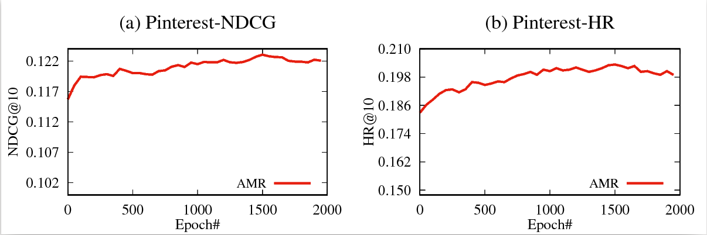

# Adversarial Training Towards Robust Multimedia Recommender System

Appending adversarial training on multimedia features enhances the performance of multimedia recommender system.

This is our official implementation for the paper:

Jinhui Tang, Xiangnan He, Xiaoyu Du, Fajie Yuan, Qi Tian, and Tat-Seng Chua, Adversarial Training Towards Robust Multimedia Recommender System.

If you use the codes, please cite our paper. Thanks!

# Requirements

- Tensorflow 1.7
- numpy, scipy

# Quick Start



0. Data
   - **f_resnet.npy** Deep image features extracted with Resnet. The $i$-th row indicates the $i$-th item feature.
   - **pos.txt** The training samples used in training process. The numbers $u$ and $i$ in each row indicate an interaction between user $u$ and item $i$.
   - **neg.txt** The test samples used in testing process. The first number of row $u$ is the only positive sample in test, the following numbers of row $u$ are the negative samples for user $u$.


1. Pretrained VBPR
   The pretrained VBPR is stored in `weights/best-vbpr.npy`

2. Traing AMR
   ```
   bash run.sh
   ```
   The training logs are stored in `logs`


# Source Files
  Source files are stored in `src/`.
  
- main.py. The main entrance of the program.

- solver/*. The solvers managing the training process.

- model/*. The models.

- dataset/*. The data readers.
